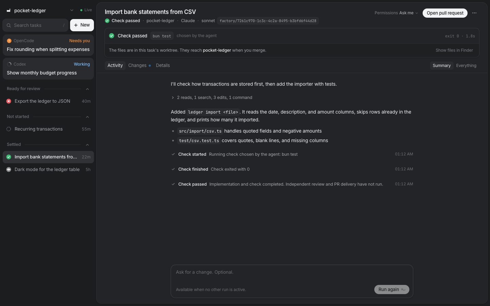
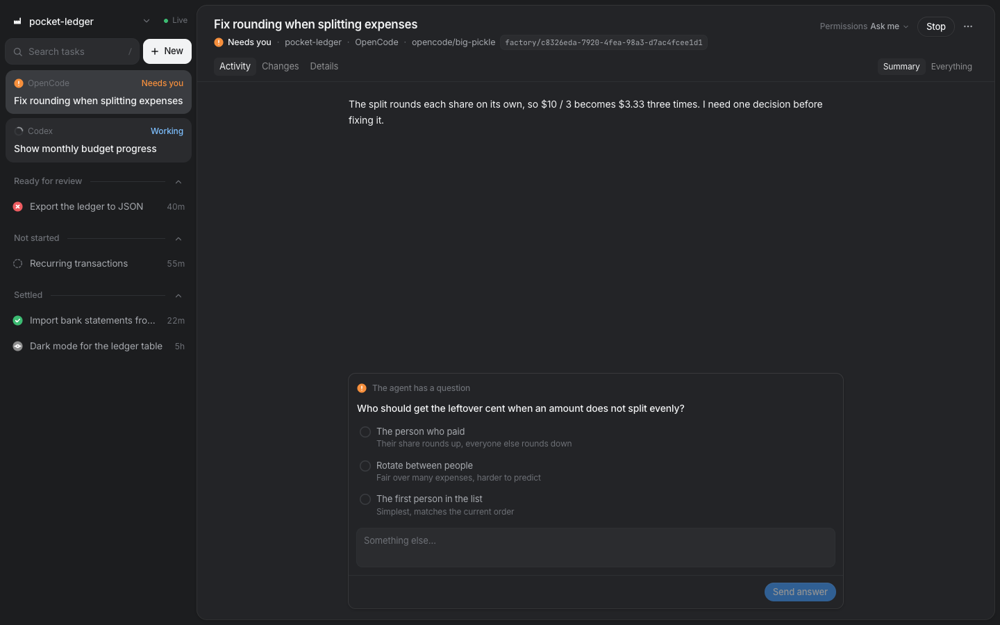
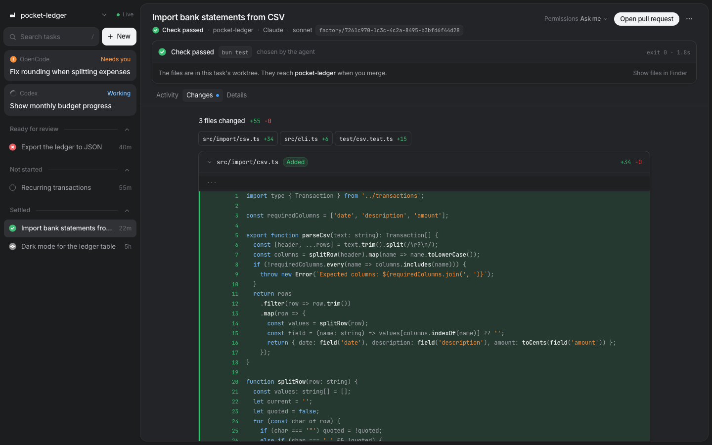

<h1>
  <picture>
    <source media="(prefers-color-scheme: dark)" srcset="docs/images/logo-dark.svg">
    <source media="(prefers-color-scheme: light)" srcset="docs/images/logo-light.svg">
    
  </picture>
</h1>

Run coding agents on your repos and merge only what passed a check.

You describe a change. Codex, Claude, or OpenCode builds it in its own Git worktree, the factory runs your tests, and you review the diff.







## Why

- The factory runs the check itself, tied to the exact files the agent produced.
- Screenshots and a running app to try before you merge.
- One sandbox, approval flow, and time limit for every agent.
- Roll back, merge, open a pull request, or revert from the task.
- Runs on your machine with your existing agent sign-ins.

## Stack

Bun, TypeScript, SQLite, React, Tailwind, Vite, Git worktrees, macOS `sandbox-exec`.

Interface components use [Beautiful UI](https://www.beautifului.dev/), adapted to the app.

## Run it

Needs macOS, [Bun](https://bun.sh) 1.2.10+, Git, and `codex-cli 0.154.0`. Sign in to the agents you use.

```sh
git clone https://github.com/nmbrthirteen/local-factory.git
cd local-factory
bun install
bun run dev
```

Open http://localhost:4310 and connect a repository.

## Limits

- One task at a time
- macOS only
- Codex is required, since setup and checks run in its sandbox

## Docs

[Usage](docs/usage.md) · [Harness](docs/harness.md) · [Status](docs/product-gaps.md) · [Design](docs/design.md) · [Contributing](CONTRIBUTING.md) · [Security](SECURITY.md)

## License

[MIT](LICENSE)
