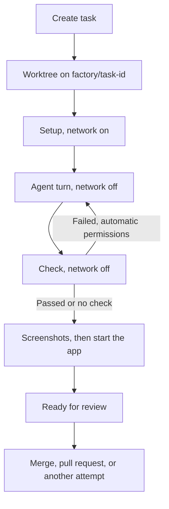

# How runs work

`server.ts` serves the API and interface on `127.0.0.1:4310`. Runs live in `backend/runner.ts`, adapters in `backend/agents/`, storage in `backend/store.ts`.

## A run

1. A worktree is created at `.factory/worktrees/<repo>/<task>` from the base commit.
2. Setup runs with network on for up to 10 minutes. If it changes tracked files, the run stops.
3. The agent works with network off.
4. The check runs offline for up to 2 minutes, recorded with its exit code and Git tree. A check that changes the tree fails.
5. The patch is saved, screenshots are taken, and the app starts for review.

One run is active at a time.

## Checks

The first of: the task's check, the agent's `CHECK: <command>` line, `npm test`, or `node --test`. With none, the task is Unchecked.

## Agents

- **Codex:** `codex-cli 0.154.0` app-server, `workspace-write` sandbox, network off, hooks, plugins, and MCP servers off.
- **Claude:** Agent SDK 0.3.268, no setting sources, OS sandbox with an empty network allowlist, only the factory MCP server.
- **OpenCode:** 1.18.30 headless server with a random password, project config off, shell under `sandbox-exec`.

Each adapter reads back the effective policy and fails the run on a mismatch.

## Instructions

Agents get `agents/implementer.md`, then global and repository `CLAUDE.md` and `AGENTS.md` (deduplicated, 64 KB each), then delivery rules: no push, pull request, merge, or history changes.

## Preview

The app starts from the agent's `PREVIEW:` line or a `preview`, `dev`, `start`, `ui`, or `serve` script, under `sandbox-exec` with loopback only. `agent-browser` takes desktop and phone screenshots. Codex and Claude also get `preview_*` tools. `backend/live.ts` keeps one app running for review until merge, settle, or rollback.

## Delivery

- **Merge:** `git merge --no-ff` into your current branch, with clean tracked files.
- **Pull request:** pushes the branch and runs `gh pr create`.
- **Roll back, Undo commit, Remove worktree:** change only the task's worktree and branch.

Revert and `gh pr merge` or `close` come from `shared/commands.ts`. The API accepts a command ID and rebuilds the arguments itself.

Suggested commands run through `backend/terminal.ts` with `/bin/zsh -lc` in the worktree, outside the sandbox, one per task.

## API and recovery

The API accepts loopback hosts and same-origin requests with an `HttpOnly` session cookie. `/api/events` pushes changes over SSE.

After an unexpected stop, active tasks wait for you to acknowledge, then become Interrupted with their worktrees kept.

## Not built

An independent reviewer, and a repair loop driven by its findings.
