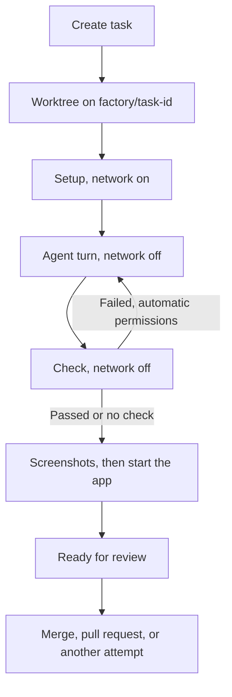

# How runs work

Local Factory runs one agent task at a time against a repository you connect. Each task gets its own Git worktree and branch. The service installs dependencies, runs the agent in a sandbox, runs the check itself, and leaves the result for you to merge or open as a pull request.

`server.ts` serves the API and interface on `127.0.0.1:4310`. The run lifecycle is in `backend/runner.ts`, agent adapters in `backend/agents/`, state and the event log in `backend/store.ts` (`bun:sqlite`), and shared types, states, and delivery commands in `shared/`.

## A run

1. Creating a task records the repository's HEAD as the base commit. The first start fails if HEAD has moved since.
2. The runner creates `.factory/worktrees/<repo>/<task id>` on branch `factory/<task id>`.
3. Setup runs the task's setup command or the lockfile recipe (`npm ci`, or `pnpm`, `yarn`, or `bun install --frozen-lockfile`) through Codex `command/exec`, with network on and a 10 minute timeout. Writable roots are the worktree and `.factory/cache`, and package manager caches and `TMPDIR` point into that cache because the sandbox blocks writes under your home directory. If setup changes any file Git would commit, the run stops before the agent starts.
4. The agent works in the worktree with network off.
5. The check runs offline with a 2 minute timeout and a 24 KB output cap. The runner records the command, exit code, output, duration, and the Git tree it ran against. A check that modifies that tree fails the run.
6. The diff is exported with `git diff --cached --binary --output` to `.factory/artifacts/<task>/<tree>.patch` and saved as a snapshot in the task history.
7. If the check passed or no check ran, the runner captures screenshots and starts the app for review.

## Limits and permissions

One run is active at a time. Permissions can change during a run, and switching to an automatic level answers pending requests immediately.

| Level | Questions | Permission requests | Time per attempt |
| --- | --- | --- | --- |
| Ask me | You answer | You decide | 15 minutes |
| Automatic, sandboxed | "Use your best judgment from the task description and keep going." | Declined | 45 minutes |
| Automatic, full access | Same answer | Allowed | 45 minutes |

The clock pauses while a request waits for you, and a run over its limit is stopped. Automatic answers are logged. With an automatic level, a failed check starts another attempt, up to 3 in total.

You can start another attempt on a task that failed, stopped, was interrupted, or is ready for review, until it has a commit. It reuses the worktree, skips setup, and tells the agent the attempt number, the last check's exit code and output tail, and your note.

## Checks

`backend/checks.ts` uses the first of:

1. The task's check command.
2. The last `CHECK: <command>` line in the agent's final message, ignoring `true`, `:`, `echo`, `printf`, and `exit`.
3. `npm test` when `package.json` has a real `test` script.
4. `node --test` when there are `*.test.js` files or JavaScript files under `test/` or `tests/`.

Without a task check, the agent is told to write tests and name them with a `CHECK:` line. If nothing resolves, the task ends as Unchecked and shows a warning. Only the exit code the service reads counts as a pass.

## Agents

### Codex

Requires `codex-cli 0.154.0` exactly, because app-server is still experimental. Codex must be installed for every agent, since setup and checks run through its sandbox.

`codex app-server --stdio` starts with hooks, apps, plugins, and MCP servers off. Each run also disables every MCP server in your config and web search, limits the inherited shell environment to `core`, and keeps `/tmp` and `TMPDIR` out of writable roots. The thread uses `workspace-write` with network off, `on-request` approvals reviewed by you, and model fallback off. The runner compares the thread response with this policy, including working directory and model, and fails on a mismatch. Server requests other than command approval, file change approval, and user input are refused.

### Claude

Uses `@anthropic-ai/claude-agent-sdk` 0.3.268, pinned, which bundles Claude Code 2.1.268 and uses your Claude login. Each session has `settingSources: []`, strict MCP config, no session persistence, a minimal environment, and the tools Read, Edit, Write, Glob, Grep, Bash, and AskUserQuestion. The only MCP server is the in-process `factory` server with the preview tools. Permission mode is `acceptEdits`. Bash runs in Claude Code's OS sandbox with `failIfUnavailable`, unsandboxed retries off, and an empty network allowlist. Network access, edits outside the worktree, and questions reach you through `canUseTool`.

The runner checks `system/init` (version, working directory, model, permission mode, tools, MCP servers, plugins) and fails on a mismatch. Estimated cost, usage, and API retries are logged.

### OpenCode

Runs the pinned `opencode-ai` 1.18.30 from `node_modules` as a headless server per run, on a free loopback port with a random password. Its environment disables project config, autoupdate, sharing, default plugins, Claude Code compatibility, external skills, and LSP downloads, and `XDG_CONFIG_HOME` points at an empty directory. The config has no MCP servers or plugins, with LSP, formatters, and snapshots off. Sign-ins come from OpenCode's own data directory.

OpenCode has no OS sandbox, so its shell is a wrapper that runs each command under `sandbox-exec`: no network, writes only to the worktree, a per-run temp directory, and the shared cache. `edit` and `bash` are allowed, `webfetch` and `websearch` denied, `external_directory` and `doom_loop` ask you. Before prompting, the adapter reads the effective config and fails if the directory, shell, plugins, MCP servers, or permissions differ. OpenCode gets no preview tools.

## Instructions

Every agent receives the role in `agents/implementer.md`, then instruction files, then delivery rules: keep messages short, and do not push, open a pull request, merge, deploy, or change Git history.

`backend/instructions.ts` reads `~/.claude/CLAUDE.md`, `$CODEX_HOME/AGENTS.md` (default `~/.codex/AGENTS.md`), and `$XDG_CONFIG_HOME/opencode/AGENTS.md` (default `~/.config/opencode/AGENTS.md`), then `CLAUDE.md` and `AGENTS.md` from the worktree root, so repository rules come last. Duplicate content is included once, files are capped at 64 KB, and Codex skips the `AGENTS.md` files it loads itself. Claude gets the text appended to its system prompt, OpenCode as system instructions, and Codex as developer instructions. Each run records the files used (shown in Details) and a SHA-256 digest.

## Preview

The start command comes from the last `PREVIEW: <command>` line in the agent's final message, the previous preview command, or the first `preview`, `dev`, `start`, `ui`, or `serve` script in `package.json` (`bun run` when `bun.lock` exists, `npm run` otherwise).

`backend/preview.ts` runs the app under `sandbox-exec` with loopback networking only, the service port blocked, and writes limited to the worktree and a scratch directory. It sets a free `PORT`, `HOST=127.0.0.1`, `BROWSER=none`, and `CI=1`, and waits up to 60 seconds for a local URL to answer.

Screenshots use the `agent-browser` CLI with its proxy set to `127.0.0.1:9`, where nothing listens, and a bypass for localhost, so pages reach loopback only. Capture waits for fonts, disables animations and the caret, and shoots desktop (1280x800) and phone (390x844). Page errors and console lines containing "error" are recorded. Results go to `.factory/artifacts/<task>/<tree>/preview` and can be retaken from the Preview tab when no run is active.

Codex (as dynamic tools) and Claude (through the `factory` MCP server) get preview tools from `backend/browser.ts`, backed by the same sandbox and browser:

- `preview_open`: start or restart the app, load a path, return a screenshot and page errors.
- `preview_screenshot`: capture at desktop or phone size.
- `preview_logs`: console output, page errors, failed requests, and app output.
- `preview_interact`: click, fill, press a key, run JavaScript, or read the accessibility tree.

Agent screenshots are saved under `.factory/artifacts/<task>/agent-preview` and shown in Activity. The app and browser close when the turn ends.

When a run ends ready for review with screenshots, `backend/live.ts` starts the app again so you can use it through Open app. One app runs at a time, since many dev servers want the same port. It stops when you start another app or attempt, roll back, merge, settle, remove the worktree, or press Stop.

## Delivery

`backend/delivery.ts` and `backend/github.ts` run Git with hooks, fsmonitor, and terminal prompts off. Only `git push` and `gh` receive `SSH_AUTH_SOCK`, `GH_TOKEN`, `GITHUB_TOKEN`, and `XDG_CONFIG_HOME`.

- Commit: for a task ready for review whose worktree still matches its snapshot. Uses your Git identity and needs `user.email`.
- Merge: commits if needed, requires your repository on a branch with no uncommitted tracked changes, runs `git merge --no-ff`, aborts on failure, then removes the worktree and keeps the branch.
- Open pull request: needs an `origin` remote. Commits if needed, pushes the branch, and runs `gh pr create` against origin's default branch (or your current branch) with the description, agent, model, and check in the body.
- Undo commit: `git reset --soft HEAD~1`, only while the branch still points at the recorded commit and nothing is merged.
- Roll back: `git read-tree -u --reset` restores an attempt's snapshot or the base tree, and status and check evidence follow the snapshot, so a restored passing attempt can be committed without rerunning its check. Undo the commit first if there is one.
- Remove worktree: `git worktree remove --force`, deleting the branch unless it holds a commit.

Commands offered after delivery are a fixed allowlist in `shared/commands.ts`:

| Task | Commands |
| --- | --- |
| Merged, not reverted | `git revert -m 1 --no-edit <merge commit>` |
| Pull request open | `gh pr merge <url> --merge`, `gh pr close <url>` |

The API accepts only a command ID and rebuilds the arguments from the task. Revert requires the repository on the merge's branch, clean tracked files, and the merge commit still present, and a failed revert is aborted. After a `gh` command, and when you open a task with an open pull request, the task records the state GitHub reports. Each run is logged with its command.

## Suggested commands

Shell code blocks and inline commands starting with a known tool (`web/src/lib/shellCommands.ts`) get a Run button once the task has no active run. Run confirms with the exact command and directory.

`backend/terminal.ts` runs it with `/bin/zsh -lc` in the worktree, or the repository if the worktree is gone. These commands run as you, outside the sandbox, with `PATH`, `HOME`, `USER`, `LOGNAME`, `TMPDIR`, `LANG`, and `TERM=dumb`. One command runs per task. Output streams every 400 ms and keeps the last 64 KB, the first local URL becomes an Open link, and Stop ends the process group. Results are logged, and a restart marks running commands stopped.

## Local API and live updates

`backend/api.ts` accepts only `localhost` or `127.0.0.1` on the service port as `Host`, and requires a same-origin `Origin` for anything but GET. `POST /api/session` sets an `HttpOnly`, `SameSite=Strict` cookie that every other route requires. JSON bodies are capped at 24 KB and diffs are served up to 1 MB.

`/api/events` signals every stored change and pings every 10 seconds. The browser reconnects after 30 seconds of silence with a new cookie, serializes and coalesces refreshes, and also refreshes every 15 seconds. Events load 200 at a time from a cursor, the interface keeps the latest 200, and Download activity streams the full log as JSONL. Agent activity arrives as whole messages and tool events; token deltas are not streamed yet.

## Recovery and shutdown

SIGINT or SIGTERM stops the active run, running commands, and the running app. After an unexpected stop, previously active tasks are flagged at startup and new runs wait for you to acknowledge. Acknowledging refuses while a recorded Codex or agent process still exists, then marks the tasks Interrupted and keeps their worktrees.

## Not built yet

- Independent reviewer: a fresh session for the exact candidate with the criteria, diff, and check evidence, and source writes blocked.
- Repair loop with findings: reviewer findings start a bounded repair attempt, then the check and review run again. A new candidate invalidates earlier evidence.
